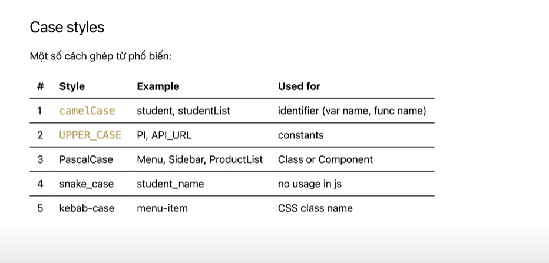

# Exercises of week 01
### I. Cài đặt môi trường  
- [x] Cài đặt extension: Simple React Snippets 
    
- [x] Cài đặt NodeJS và Git scm
    - Cài đặt NodeJS: https://nodejs.org/en/download/
    - Cài đặt Git scm: https://git-scm.com/
- [x] Cài đặt react developer tools và redux dev tool trên tiện ích
    - React developer tools
    
    - Redux DevTools
    
### II. Tìm hiểu ReactJS, SPA/MPA, JSX
##### 1. ReactJS là gì?
 - [x] ReactJS là một opensource được phát triển bởi Facebook, ra mắt vào năm 2013, bản thân nó là một thư viện javascript dùng để xây dựng UI, UI ở đây được dùng chính ở 2 nền tảng Web và Mobile. Ở lĩnh vực Web, sử dụng Reactjs có thể đem lại trải nghiệm tốt cho người dùng, cũng như khả năng Hot Reload giúp bạn lập trình nhanh hơn.
##### 2. SPA/MPA: (Tham khảo: https://www.youtube.com/watch?v=30sMCciFIAM)
- [x] SPA - Single-Page Application
    - Được cho là cách tiếp cận hiện đại hơn
    - Không yêu cầu tải lại trang trong quá trình sử dụng
    - Kiến trúc 1 trang
    - Nhanh hơn khi sử dụng (vì tải hết 1 lần và lưu tại RAM) vì phần lớn tài nguyên chỉ tải trong lần đầu và chỉ tải thêm dữ liệu mới khi cần
    - Nhưng lần đầu tải có thể bị chậm nếu tối ưu không tốt
    - Không thân thiện với SEO hay Search Engine Optimization (tối ưu hóa công cụ tìm kiếm)
    - VD: Facebook, Shoppe, ZingMP3

- [x] MPA - Multi-Page Application
    - Cách tiếp cận cổ điển
    - Tải lại trang trong quá trình sử dụng
    - Chậm hơn khi sử vì luôn tải lại toàn bộ khi truy cập và điều hướng
    - Thân thiện với SEO
    - VD: các trang báo mạng
### III. Khởi tạo dự án, tìm hiểu về components
##### 1. Khởi tạo dự án (tham khảo: https://create-react-app.dev/docs/getting-started/)
- [x] Với npm: 
    ```sh
    npm install -g create-react-app
    create-react-app my-app
    ```
- [x] Với npx:
    ```sh
    npx create-react-app my-app
    cd my-app
    npm start
    ```
- [x] Với yarn
    ```sh
    yarn create react-app my-app
    ```
- [x] Với vite:
    ```sh
    npm create vite
    yarn create vite
    ```

##### 2. Components
- Cho phép chúng ta chia nhỏ UI để tái sử dụng (header, footer, button,card, …)
- Chia càng nhỏ càng dễ quản lý

##### 3. Deploy với Vercel hoặc github page
- [x] Vercel
    - https://vercel.com/guides/deploying-react-with-vercel
    - https://www.youtube.com/watch?v=qwy6tOD0v4g
- [x] Github Page
    - https://viblo.asia/p/deploy-ung-dung-reactjs-len-github-pages-1VgZvw3MlAw

##### 4. Lưu ý
- [x] Bình thường ở html thuần thì khi ta đặt class sẽ là kiểu \<div class="abc"> còn với react thì class sẽ được thay bằng className(lý do từ khóa class bị trùng với từ khóa class components) 
**\<div className="abc">**
    
- [x] Cách style inline trong react: 
**\<div className="app" style={{ height: '100vh' }}>**

- [x] Cách import file css vào file jsx:  
**import './App.css';**

- [x] Cách sử dụng sự kiện onClick:


- [x] Cách đặt tên biến:



