# useState, props,props children, rendering lists

# I. useState

### useState là 1 React Hook dùng để thêm 1 **state variable** (biến trạng thái) cho component.

- state: là thông tin được lưu trữ trong 1 component, component có thể tùy chỉnh thông tin đó

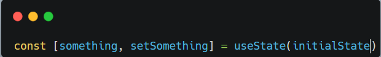

- **initialState**: Giá trị khởi tạo của state
- **useState trả về 1 mảng gồm 2 giá trị**

  1. state hiện tại. Trong lần render đầu tiên thì nó chính là initialState.
  2. hàm set giúp ta cập nhật lại giá trị của state và re-render lại giao diện.

* Lưu ý:

  - useState chỉ gọi ở phần đầu của component
  - Trong chế độ Strict Mode, React gọi hàm set 2 lần.
  - Hàm set sẽ không thể làm thay đổi state hiện tại ngay lập tức

  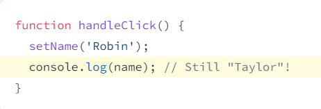

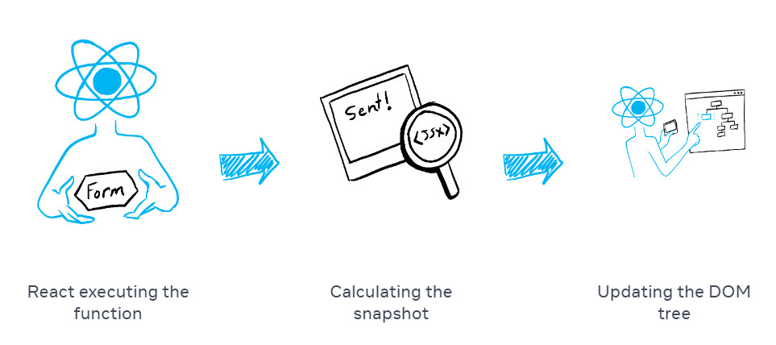

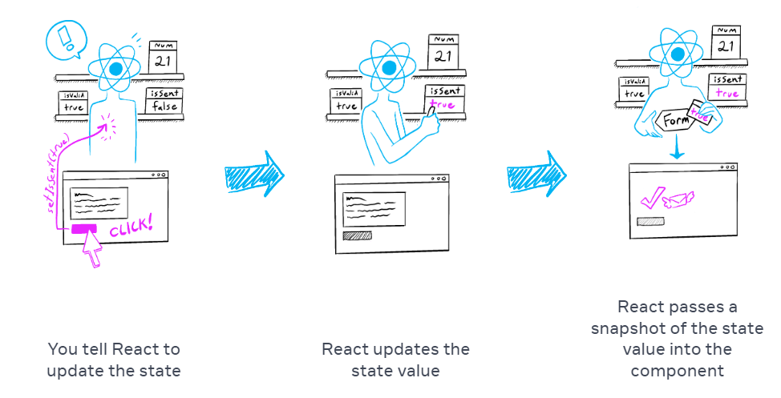

## Ví dụ luyện tập

### VD1: Counter

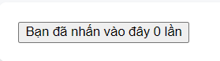
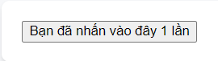

Mỗi lần nhấn nút thì số sẽ + thêm 1 đơn vị.

## VD2: Text field

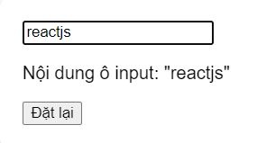

Khi thay đổi nội dung trong ô input thì nội dung trong dấu "" cũng thay đổi theo

# II. Props

- Props là thông tin mà được truyền vào thẻ JSX

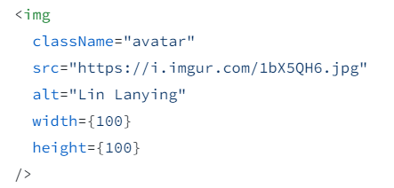

## Truyền props cho component

1. Truyền các props cho component con

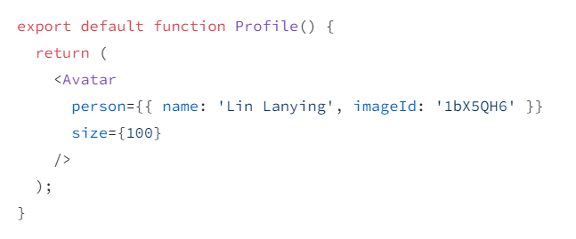 2. Đọc props ở trong component con

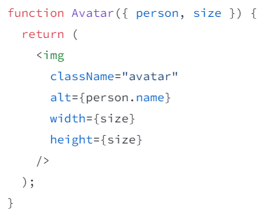

3. Children là 1 prop đặc biệt (có thể là html, component, text, variable)

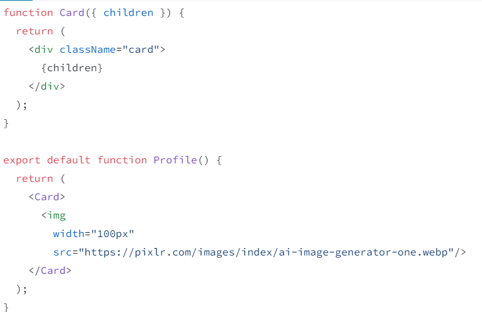

# III. Rendering Lists

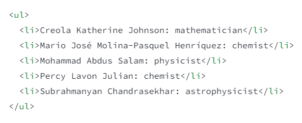

Trong ví dụ trên ta thấy thẻ li lặp lại nhiều lần với nội dung bên trong khác nhau

Để viết code clean hơn ta có thể cho các nội dung trong thẻ li vào 1 mảng và map ra UI

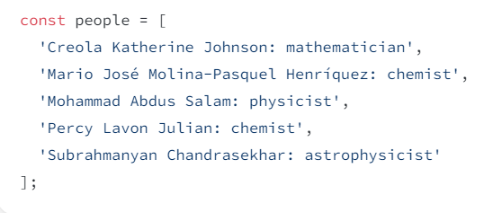

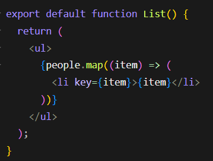

Ta phải thêm prop "key" với các giá trị khác nhau để phân biệt chúng với nhau
