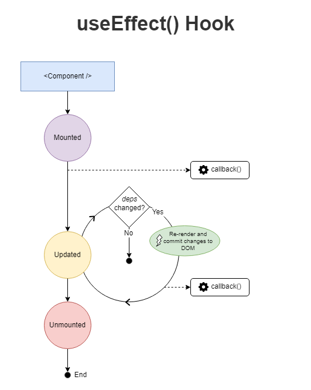
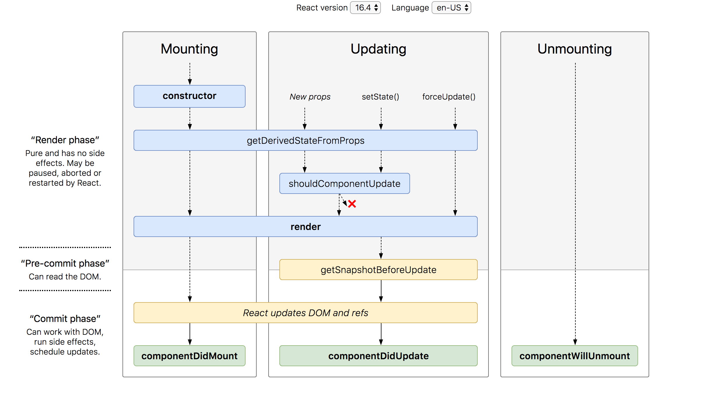

# useEffect

Là 1 React hook dùng để xử lý các hành động side effects (xử lý những thứ nằm bên ngoài component. Ví dụ như gọi API, tương tác DOM, setTimeout, setInterval)

**useEffect(callback, [dependencies])**

1. useEffect(callback)
   - Gọi callback mỗi khi component re-render
   - Gọi callback thêm element vào DOM
2. useEffect(callback, [ ])
   - Chỉ gọi callback 1 lần sau khi component mounted
3. useEffect(callback, [dependencies])
   - Callback sẽ được gọi lại mỗi khi dependencies thay đổi

# ReactJS Lifecycle

