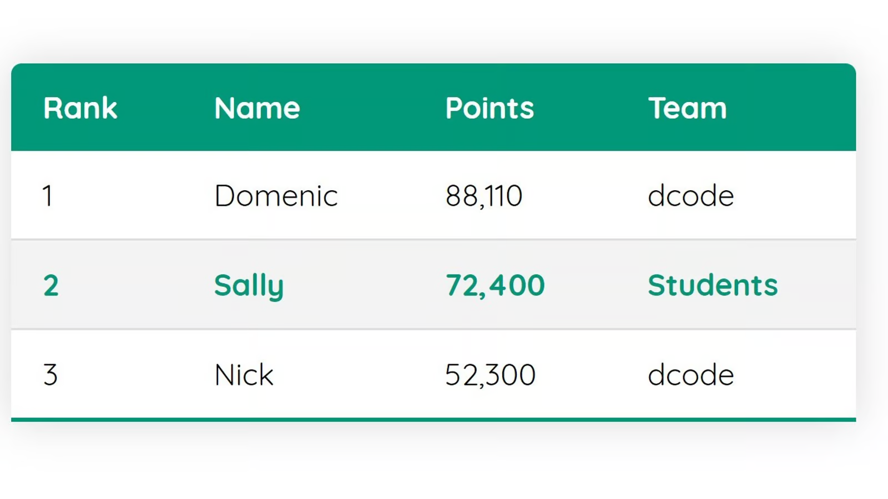
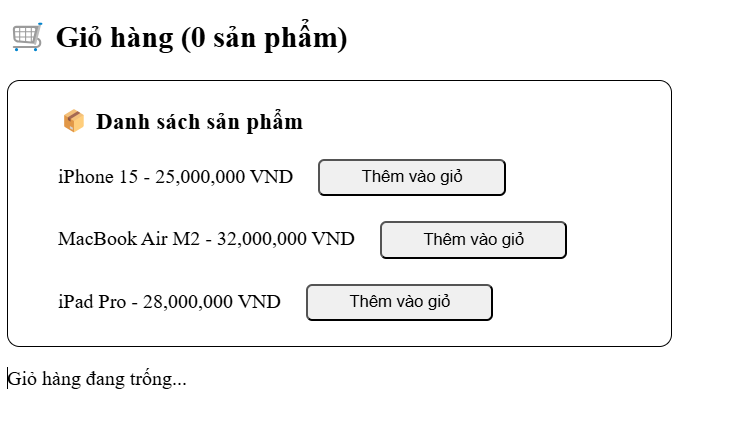
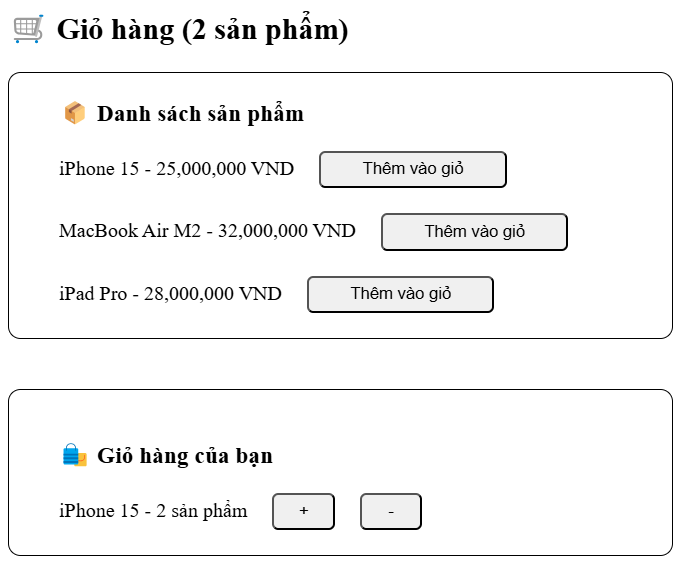

## Bài tập về nhà buổi 2

#### 1. Ôn tập:

- [x] useState
- [x] props, props children
- [x] rendering list

#### 2. Yêu cầu tìm hiểu thêm về:

- [x] sass/scss
- [x] Tailwind css
- [x] Style-components
- [x] Css module

#### 3. Bài tập về nhà

- [x] Bài 1: Dùng dữ liệu trong file posts.json thuộc folder data trong folder data của Exercise-02 và render dữ liệu ra màn hình dưới dạng table có 3 cột (id, title, body) - lưu ý dùng rendering list, props, props. Yêu cầu bảng được style theo mẫu sau:
      
- [x] Bài 2: sử dụng useState để tạo nút toggle (lưu ý: nút toggle phải di chuyển trái phải mỗi khi click vào ô tròn đồng thời chữ on cũng sẽ thay đổi thành off trong các trường hợp tương ứng)
      
- [x] Bài 3: Sử dụng useState và Props làm bài tập về quản lý giỏ hàng:
  - Yêu cầu:
  1. Tạo một danh sách sản phẩm chứa: tên sản phẩm, giá sản phẩm, button thêm vào giỏ hàng.
  2. Khi nhấn vào button sản phẩm sẽ được thêm vào giỏ hàng.
  3. Trong giỏ hàng hiển thị danh sách sản phẩm đã thêm với số lượng từng sản phẩm.
  4. Cho phép người dùng tăng/giảm số lượng sản phẩm trong giỏ:
     - Nhấn "+" để tăng số lượng.
     - Nhấn "-" để giảm số lượng (nếu về 0, sản phẩm bị xóa khỏi giỏ).
  5. Hiển thị tổng số sản phẩm trong giỏ hàng.
  - Gợi ý:
  1. Dùng useState để quản lý trạng thái giỏ hàng dưới dạng {id: quantity}.
  2. Dùng props để truyền dữ liệu và hàm xử lý giữa các component (ShoppingCartApp,ProductList, Cart).
  - Nếu có 0 sản phẩm trong giỏ hàng:
    
  - Nếu trong giỏ hàng có sản phẩm:
    
